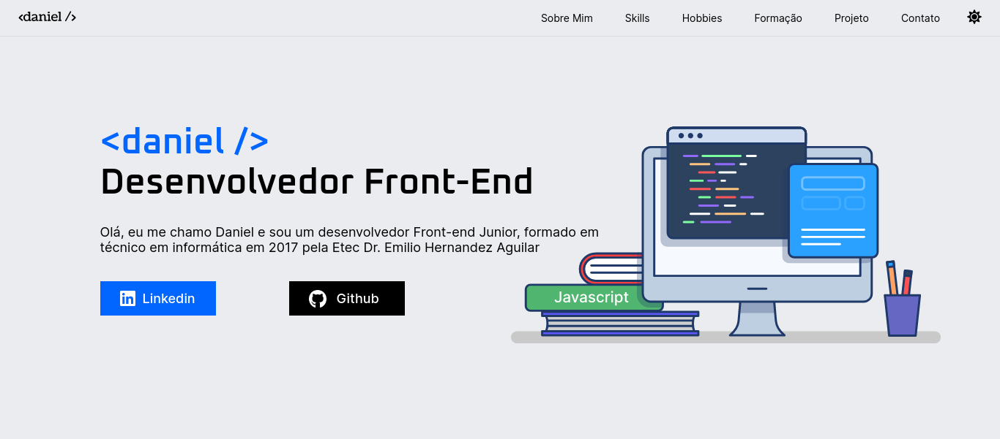
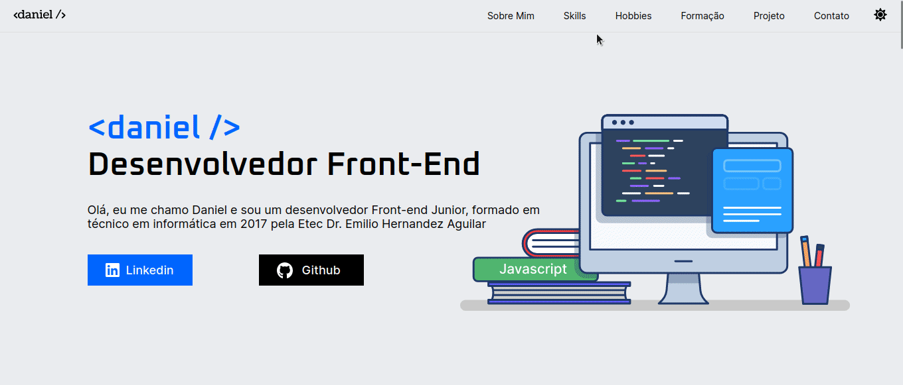

<h1 align="center">Challenge ONE Sprint 02 - Turma 5</h1>

  <a href="#-sobre-o-desafio">Sobre o desafio</a>&nbsp;&nbsp;&nbsp;|&nbsp;&nbsp;&nbsp;
  <a href="#-design-do-decodificador-proposto-pelo-challenge">Design</a>&nbsp;&nbsp;&nbsp;|&nbsp;&nbsp;&nbsp;
  <a href="#-design-feito-por-mim-no-figma">Meu Design</a>&nbsp;&nbsp;&nbsp;|&nbsp;&nbsp;&nbsp;
  <a href="#-tecnologias">Tecnologias</a>&nbsp;&nbsp;&nbsp;|&nbsp;&nbsp;&nbsp;
  <a href="#-metodologias">Métodologias</a>&nbsp;&nbsp;&nbsp;

## Sobre o desafio

    O objetivo desse Challenge era desenvolver um portifólio com base em um design do figma, onde seria o local onde nós colocariamos informações como uma biografia, formação e os desafios que foram feitos no programa ONE, além disso, serviria para colocar em prática aquilo que foi ensinado nas aulas como html, css, metodologias e tc. 

## 🔖 Design feito por mim no Figma

    Já havia um design de um portifólio que poderia ser seguido, mas eu resolvi cria o meu próprio design com base no design proposto no desafio.

    

    Você pode visualizar o layout do projeto que eu fiz através <a href="https://www.figma.com/file/Aq2q1wx4FThzRdTlGorQ27/Portf%C3%B3lio?type=design&node-id=0%3A1&t=aRyjRuqelPMd3n32-1" target="_blank">DESSE LINK</a>. É necessário ter conta no <a href="https://figma.com" target="_blank">Figma</a> para acessá-lo.

<h2 align="center">💻 Projeto finalizado</h2>

  <table>
    <legend>Tempo gasto da criação do design até o Deploy.</legend>
    <tr>
      <th>🚩 INICIADO</th>
      <th>✅ FINALIZADO</th>
      <th>⏱️ HORAS APROXIMADAS</th>
    </tr>
    <tr>
      <td>11/06/2023</td>
      <td>18/06/2023</td>
      <td>64 HORAS</td>
    </tr>
  </table>

    

<h3 align="center">Prévia do projeto em funcionamento</h3>

    <a href="https://danieldemoura.github.io/portifolio" target="_blank">🚀 Acesse por esse link o projeto online</a>

  

### 👨‍💻 Tecnologias

Esse projeto foi desenvolvido com as seguintes tecnologias:

- HTML e CSS
- JavaScript
- Figma

### Métodologias
Para a criação desse projeto eu utilizei as seguintes metodologias:
- BEM e NAMESPACE
    - Para dar nome as classes CSS
- Atomic Design
    - Para a estrura e a organização dos arquivos em pastas e criação de um arquivo CSS para cada componente da página.

---

    Feito com ♥ by Daniel :wave: <a href="https://www.youtube.com/channel/UCHf8h4M94Wnw5o4deGWZKnw" target="_blank">Challenge ONE Sprint 02</a>

